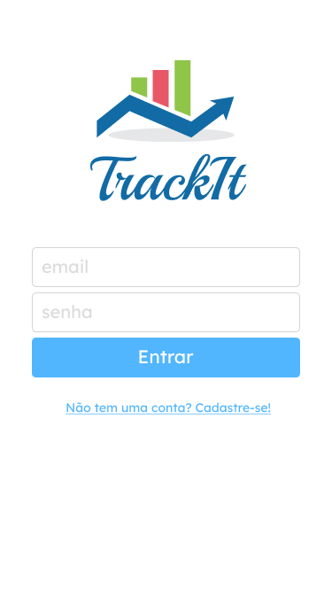
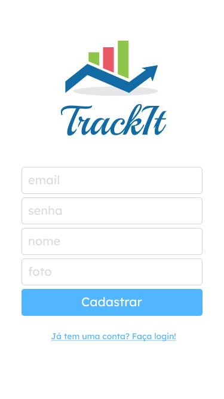
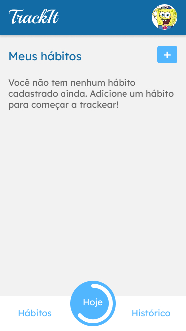
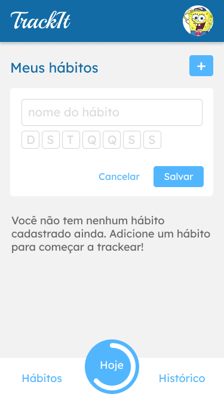
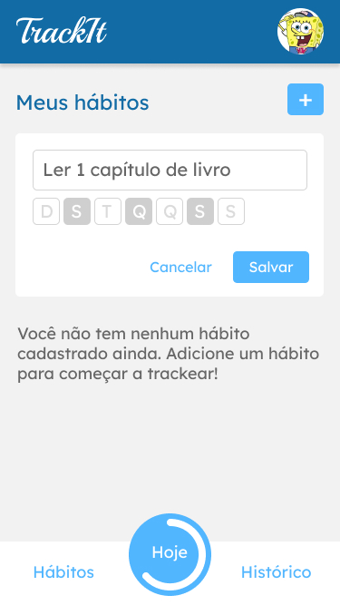
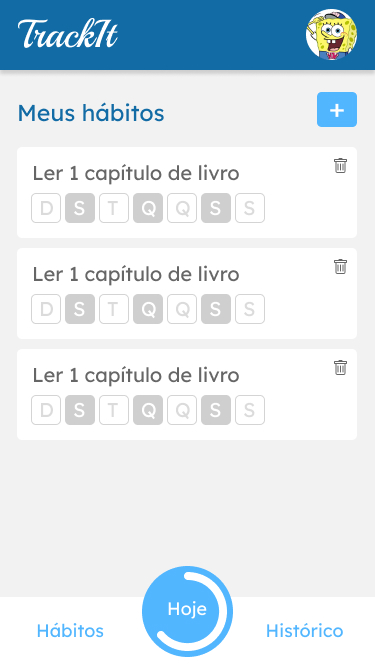
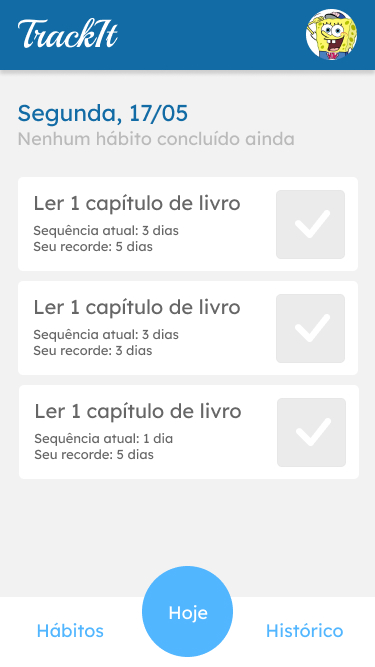
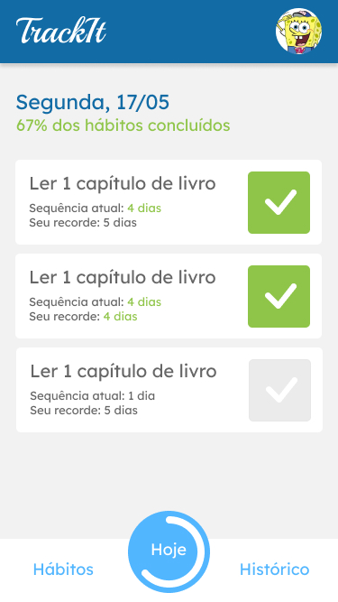

# Trackit - Monitoramento de Hábitos
<table>
  <tr>
    <td align="center" style="padding: 0; margin: 0;">
      
    </td>
    <td align="center" style="padding: 0; margin: 0;">
      
    </td>
    <td align="center" style="padding: 0; margin: 0;">
      
    </td>
    <td align="center" style="padding: 0; margin: 0;">
      
    </td>
  </tr>
</table>

<table>
  <tr>
    <td align="center" style="padding: 0; margin: 0;">
      
    </td>
    <td align="center" style="padding: 0; margin: 0;">
      
    </td>
    <td align="center" style="padding: 0; margin: 0;">
      
    </td>
    <td align="center" style="padding: 0; margin: 0;">
      
    </td>
  </tr>
</table>

## Sobre

Trackit se trata de uma aplicação completa de acompanhamento de hábitos. Nele é possível registrar um hábito, acompanhar o dia que ele deve ser feito e marcar se foi feito.

[Deploy da aplicação](https://trackit-monitoramento-de-habitos.vercel.app/)

Este é um projeto em React.js. Segue abaixo as instruções de configuração:

Certifiquse-se de ter as seguintes ferramentas instaladas e atualizadas no seu sistema: 

- [Node.js](https://nodejs.org/)
- [npm](https://www.npmjs.com/)

## Instalação

Siga estas etapas para configurar e executar o projeto localmente:

```bash
   git clone https://github.com/BiancaDias/Trackit-MonitoramentoDeHabitos
   cd Trackit-MonitoramentoDeHabitos
```

### 1 - Instalar as dependencias
```bash
  npm install
```

### 2 - Execute o projeto

```bash
  npm start
```
